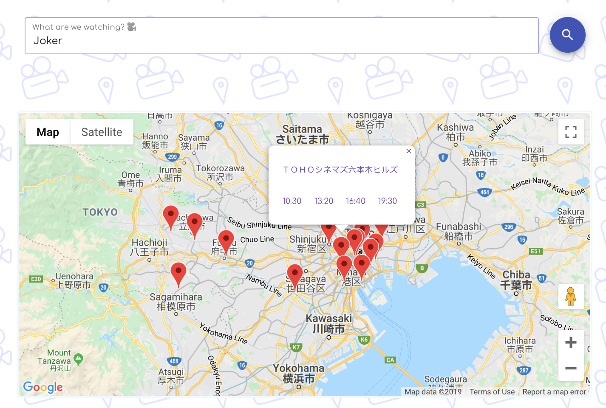

# Cinemap 🎥 🗺


### Cinemap is a responsive single-page application for finding where and when movies are showing in Tokyo.


### Try it on [Heroku](https://ccx-rakuten-rapid-api-cinemap.herokuapp.com/)!

---

## Table of Contents

1. [How to Use](#how-to-use)
2. [For Developers](#setup-getting-started)
3. [Technology Used](#technology-used)
4. [Features Coming Soon](#features-coming-soon)
5. [Contributors](#contributors)

---

## How to Use

Type in the name of the movie you'd like to see and click the search button.

A map will appear with markers indicating where that movie is showing. You can hover over each marker to see all showtimes for that cinema.



Below the map is the Movie Info section, which contains a brief synposis of the movie, as well as its runtime and IMDb rating.


You can also scroll down to see showtime information for each cinema, and a weather forecast for each date.


---

## For Developers

Fork and clone this repository, navigate to the directory, and run the following commands in your terminal:

Install dependencies:

```
yarn
```

Start the app:

```
yarn start
```

Then go to **localhost:4000** to view the app.

---

## Technology Used

Frontend:

- [React](https://reactjs.org/)
- [Material-UI](https://material-ui.com/)

Server:

- [Axios](https://github.com/axios/axios)
- [Express](https://expressjs.com/)

APIs:

- [Dark Sky](https://english.api.rakuten.net/darkskyapis/api/dark-sky)
- [IMDb](https://english.api.rakuten.net/apidojo/api/imdb8)
- [International Showtimes API](https://www.internationalshowtimes.com/)

---

## Features Coming Soon

- Location detection
- Accurate-to-the-hour forecast data
- Directions to cinemas
- Nearby restaurants

---

## Contributors

- [@followdiallo](https://github.com/followdiallo)
- [@miniengineer](https://github.com/miniengineer)
- [@noi22](https://github.com/noi22)
- [@sidiousvic](https://github.com/sidiousvic)
